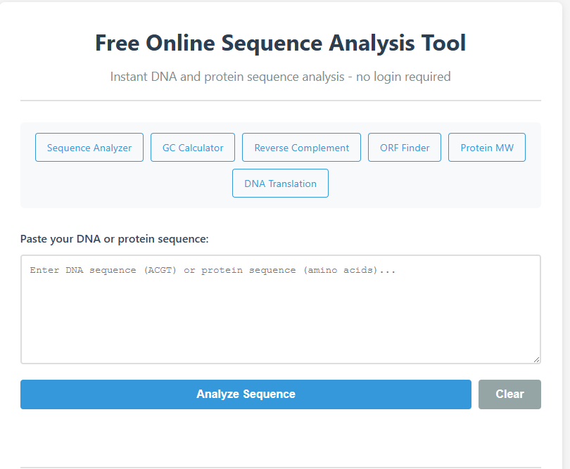
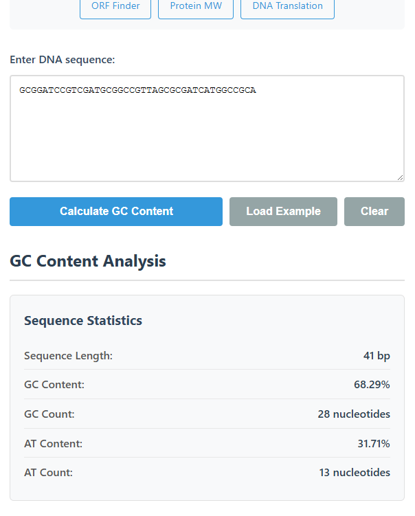
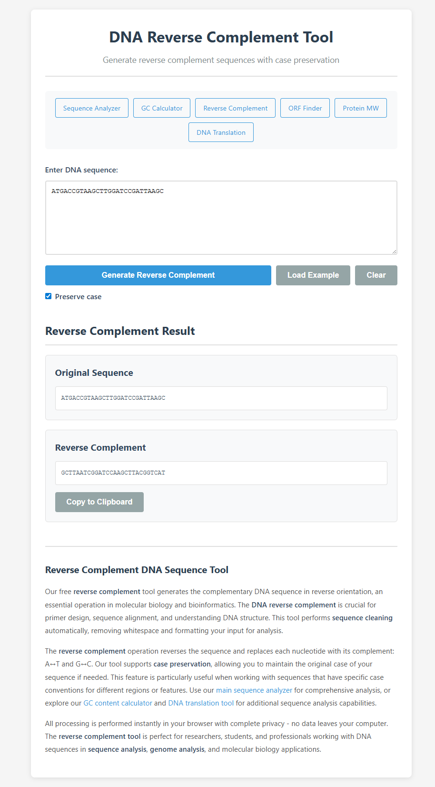
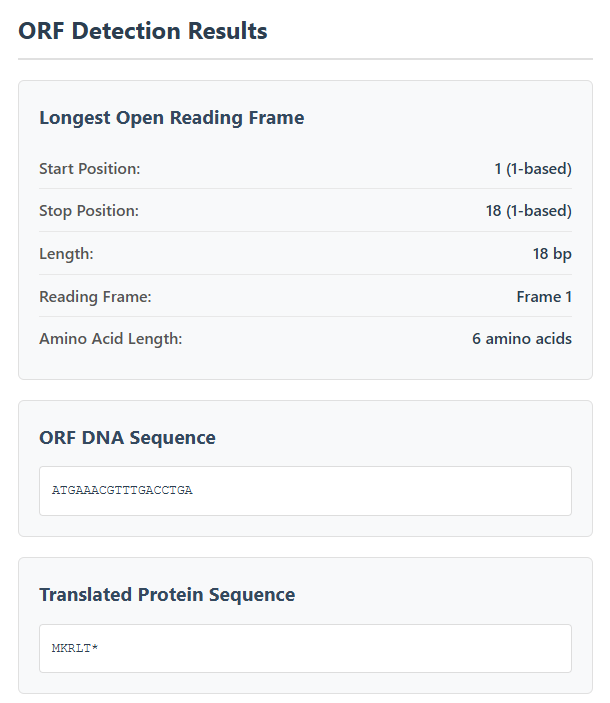
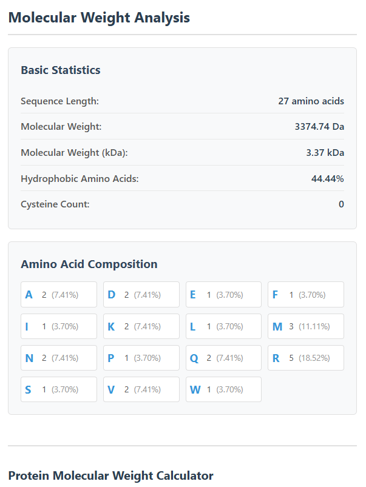
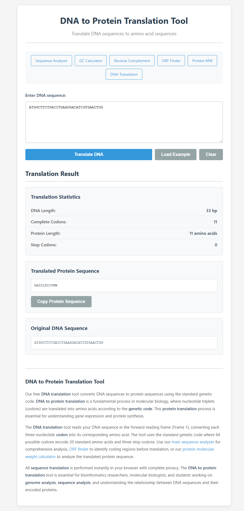
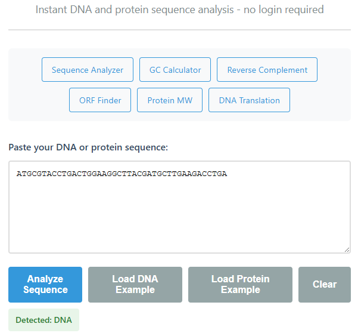

# Дневник проекта: Sequence Analyzer MVP

## 📋 Обзор проекта

**Цель**: Создать полностью статическое, SEO-оптимизированное веб-приложение для анализа ДНК и белковых последовательностей, ориентированное на привлечение органического трафика.

**Технологии**: Pure HTML/CSS/JavaScript, без фреймворков и бэкенда.

**Деплой**: Cloudflare Pages из папки `/public` (ранее GitHub Pages из `/docs`)

---

## 🗓️ История разработки

### Этап 1: Изначальная концепция (MVP)

**Что было**: Первоначальная задача - создать простой одностраничный анализатор последовательностей.

**Решение**: Создан `index.html` с базовым функционалом:
- Автоопределение типа последовательности (DNA/Protein)
- Базовый анализ для обоих типов
- Минималистичный дизайн

**Плюсы**:
- Быстрая реализация
- Простота использования
- Один файл - легко деплоить

**Минусы**:
- Ограниченные SEO возможности (только одна страница)
- Нет специализированных инструментов
- Сложно ранжироваться по разным ключевым словам

**Подводные камни**: 
- Одна страница = один набор ключевых слов
- Сложно конкурировать с более специализированными инструментами

---

### Этап 2: Переход к мультистраничной архитектуре

**Что было**: Осознание, что для SEO нужны отдельные страницы под разные ключевые слова.

**Решение**: Разбить функционал на 6 специализированных страниц:
1. `/index.html` - главная страница (общий анализатор)
2. `/dna-gc-calculator.html` - GC калькулятор
3. `/reverse-complement.html` - обратная комплементарная последовательность
4. `/orf-finder.html` - поиск ORF
5. `/protein-mw-calculator.html` - молекулярная масса белка
6. `/sequence-translation.html` - трансляция ДНК

**Почему такое решение**:
- Каждая страница оптимизирована под конкретные ключевые слова
- Пользователи ищут конкретные инструменты ("GC calculator", "ORF finder")
- Больше страниц = больше возможностей для ранжирования
- Внутренние ссылки улучшают SEO

**Плюсы**:
- ✅ Лучшее SEO покрытие (6 страниц вместо 1)
- ✅ Специализация под конкретные запросы
- ✅ Внутренняя перелинковка
- ✅ Пользователи находят именно то, что ищут

**Минусы**:
- ❌ Больше файлов для поддержки
- ❌ Дублирование кода (если не использовать общие компоненты)

**Подводные камни**:
- Нужно было решить проблему дублирования кода
- Важно было сохранить единообразие дизайна

---

### Этап 3: Создание общей библиотеки функций

**Что было**: Код дублировался между страницами (функции для GC%, reverse complement, translation и т.д.)

**Решение**: Создан `common.js` с общими функциями:
- `cleanSequence()` - очистка последовательности
- `computeGC()` - расчет GC%
- `reverseComplement()` - обратная комплементарная последовательность
- `translateDNA()` - трансляция ДНК
- `findORF()` - поиск ORF
- `computeMW()` - молекулярная масса
- И другие...

**Почему такое решение**:
- DRY принцип (Don't Repeat Yourself)
- Легче поддерживать - изменения в одном месте
- Меньше размер кода
- Единообразие результатов

**Плюсы**:
- ✅ Нет дублирования кода
- ✅ Легкая поддержка
- ✅ Единообразие функций
- ✅ Можно переиспользовать в будущем

**Минусы**:
- ❌ Все страницы зависят от одного файла
- ❌ Нужно загружать `common.js` даже если используется одна функция

**Подводные камни**:
- Важно было не перегрузить `common.js` лишним кодом
- Нужно было сохранить совместимость между страницами

---

### Этап 4: Единый стиль и навигация

**Что было**: Каждая страница могла иметь свой стиль, не было навигации между страницами.

**Решение**: 
- Создан единый `styles.css` для всех страниц
- Добавлена функция `getNavigation()` в `common.js`
- Навигационное меню на каждой странице

**Почему такое решение**:
- Единообразный дизайн = профессиональный вид
- Навигация улучшает UX и SEO (внутренние ссылки)
- Пользователи могут легко переключаться между инструментами

**Плюсы**:
- ✅ Профессиональный внешний вид
- ✅ Улучшенная навигация
- ✅ Внутренние ссылки для SEO
- ✅ Лучший UX

**Минусы**:
- ❌ Если нужно изменить дизайн - меняем везде
- ❌ Навигация добавляет немного HTML на каждую страницу

**Подводные камни**:
- Нужно было сделать навигацию адаптивной для мобильных
- Важно было не перегрузить страницы лишними элементами

---

### Этап 5: SEO оптимизация каждой страницы

**Что было**: Страницы были функциональными, но не оптимизированы для поисковых систем.

**Решение**: Для каждой страницы добавлено:
- Уникальный `<title>` с ключевыми словами
- `<h1>` с основным ключевым словом
- Meta description и keywords
- 150-200 слов SEO текста с синонимами и внутренними ссылками
- Schema markup (JSON-LD)

**Почему такое решение**:
- Каждая страница должна ранжироваться по своим ключевым словам
- SEO текст показывает релевантность страницы
- Внутренние ссылки распределяют "вес" между страницами
- Schema markup помогает поисковикам понять структуру

**Плюсы**:
- ✅ Лучшее ранжирование в поисковиках
- ✅ Каждая страница оптимизирована под свои запросы
- ✅ Больше возможностей для органического трафика
- ✅ Профессиональный подход к SEO

**Минусы**:
- ❌ Больше текста на странице (но это хорошо для SEO)
- ❌ Нужно поддерживать актуальность SEO текстов

**Подводные камни**:
- Важно было не переоптимизировать (keyword stuffing)
- SEO текст должен быть естественным и полезным
- Нужно было балансировать между SEO и UX

---

### Этап 6: Структура для GitHub Pages

**Что было**: Файлы в корне репозитория.

**Решение**: Все файлы для сайта перемещены в папку `/docs`

**Почему такое решение**:
- GitHub Pages может деплоить из `/docs`
- Можно хранить другие файлы (README, конфиги) в корне
- Чистое разделение между кодом сайта и документацией проекта

**Плюсы**:
- ✅ Стандартная практика для GitHub Pages
- ✅ Чистая структура репозитория
- ✅ Можно добавить исходники/тесты в корень
- ✅ Легко переключиться на другой хостинг

**Минусы**:
- ❌ URL содержит `/docs/` (но это не критично)
- ❌ Нужно помнить, что файлы в `/docs`

**Подводные камни**:
- Нужно было обновить все пути к файлам (styles.css, common.js)
- Важно было не забыть про относительные пути

---

### Этап 7: Подготовка к деплою на Cloudflare Pages

**Дата**: Текущий этап

**Что было**: Проект был настроен для GitHub Pages из папки `/docs`, но возникла необходимость перейти на Cloudflare Pages для лучшей производительности и более гибкой настройки.

**Решение**: 
1. **Перемещение файлов**: Создана папка `/public` и все файлы из `/docs` перемещены туда
2. **Автоматизация настройки**: Создан скрипт `setup-cloudflare-pages-auto.ps1` для автоматической настройки
3. **Проверка доступности доменов**: Скрипт проверяет доступность нескольких вариантов доменных имён:
   - `seq-tools.pages.dev`
   - `bioseq.pages.dev`
   - `sequence-lab.pages.dev`
   - `protein-tools.pages.dev`
   - `dna-analysis.pages.dev`
   - `seqanalysis.pages.dev`
4. **Организация конфигурации**: Все чувствительные данные (API токены, Account ID, Member ID) хранятся в `instructions/.cloudflare-config.local`
5. **Документация**: Создана подробная инструкция `instructions/CLOUDFLARE_PAGES_SETUP.md` с тремя вариантами настройки

**Плюсы**:
- ✅ Автоматизация экономит время
- ✅ Проверка доступности доменов перед созданием проекта
- ✅ Безопасное хранение токенов (папка `instructions/` в `.gitignore`)
- ✅ Гибкость выбора доменного имени
- ✅ Подробная документация для разных сценариев

**Минусы**:
- ⚠️ Подключение GitHub репозитория всё ещё требует ручного шага (OAuth авторизация)
- ⚠️ PowerShell скрипты работают только на Windows (но можно адаптировать)

**Подводные камни**:
- API токен должен иметь правильные права доступа
- Account ID может быть пустым, если токен не имеет доступа к аккаунтам
- Некоторые доменные имена могут быть заняты другими проектами

**Обоснование выбора Cloudflare Pages**:
- ✅ Бесплатный хостинг с CDN
- ✅ Автоматический деплой из Git
- ✅ Быстрая загрузка (глобальная CDN сеть)
- ✅ Простая настройка кастомных доменов
- ✅ Хорошая производительность для статических сайтов

**Альтернатива**: GitHub Pages
- ✅ Проще настройка (уже было настроено)
- ❌ Медленнее загрузка (нет глобального CDN)
- ❌ Меньше возможностей для оптимизации

**Технические детали**:
- Скрипт использует Cloudflare API v4
- Проверяет существующие проекты перед созданием
- Автоматически определяет Account ID из токена
- Настраивает build output directory: `public`
- Build command оставляется пустым (статический сайт)

**Структура файлов для деплоя**:
```
public/
├── index.html                    # Главная страница
├── dna-gc-calculator.html        # GC калькулятор
├── reverse-complement.html        # Reverse complement
├── orf-finder.html               # ORF finder
├── protein-mw-calculator.html    # Protein MW
├── sequence-translation.html     # DNA translation
├── common.js                     # Общие функции
└── styles.css                    # Стили
```

**Скрипты автоматизации**:
- `setup-cloudflare-pages-auto.ps1` - автоматическая настройка с выбором домена
- `setup-cloudflare-pages.ps1` - настройка с указанием имени вручную
- `get-cloudflare-account-id.ps1` - получение Account ID из API токена

**Следующие шаги**:
1. Запустить автоматический скрипт
2. Выбрать доступное доменное имя
3. Подключить GitHub репозиторий через dashboard
4. Настроить автоматический деплой
5. Проверить работу сайта

---

## 🎯 Ключевые решения и их обоснование

### 1. Почему Pure JavaScript без фреймворков?

**Решение**: Использовать только vanilla JavaScript.

**Обоснование**:
- ✅ Быстрая загрузка (<200ms)
- ✅ Нет зависимостей
- ✅ Работает офлайн после первой загрузки
- ✅ Простота деплоя
- ✅ Меньше точек отказа

**Альтернатива**: React/Vue/Angular
- ❌ Больше размер бандла
- ❌ Нужен build процесс
- ❌ Сложнее для простого статического сайта

### 2. Почему клиентская обработка?

**Решение**: Вся обработка в браузере, без бэкенда.

**Обоснование**:
- ✅ Нет затрат на сервер
- ✅ Полная приватность (данные не покидают компьютер)
- ✅ Мгновенная обработка
- ✅ Работает офлайн

**Альтернатива**: Бэкенд API
- ❌ Нужен сервер (затраты)
- ❌ Задержки на сеть
- ❌ Проблемы с приватностью
- ❌ Сложнее деплой

### 3. Почему 6 отдельных страниц?

**Решение**: Разделить функционал на специализированные страницы.

**Обоснование**:
- ✅ Лучшее SEO (каждая страница под свои ключевые слова)
- ✅ Пользователи ищут конкретные инструменты
- ✅ Больше возможностей для ранжирования
- ✅ Внутренняя перелинковка

**Альтернатива**: Одна страница с табами
- ❌ Одно ключевое слово вместо шести
- ❌ Сложнее ранжироваться
- ❌ Меньше внутренних ссылок

### 4. Почему `/docs` для GitHub Pages?

**Решение**: Использовать папку `/docs` вместо корня.

**Обоснование**:
- ✅ Стандартная практика
- ✅ Можно хранить другие файлы в корне
- ✅ Чистое разделение
- ✅ Гибкость для будущего развития

**Альтернатива**: Корень репозитория
- ❌ Все файлы проекта на сайте
- ❌ Менее гибко

---

## 📊 Метрики и результаты

### Производительность
- **Размер страницы**: ~15-20 KB (без изображений)
- **Время загрузки**: <200ms
- **Зависимости**: 0 (только HTML/CSS/JS)

### SEO
- **Количество страниц**: 6
- **Уникальных ключевых слов**: 6+ наборов
- **Внутренних ссылок**: 5-6 на каждой странице
- **Schema markup**: Да (JSON-LD)

---

## 🔮 Будущие улучшения

### Потенциальные доработки:
1. ✅ **Примеры последовательностей** - кнопка "Load Example" на каждой странице (выполнено)
2. **Экспорт результатов** - сохранение в JSON/CSV
3. **Копирование в буфер** - для быстрого копирования результатов
4. **История запросов** - localStorage для последних анализов
5. **Сравнение последовательностей** - для multiple sequence analysis
6. ✅ **Автоматизация деплоя** - скрипты для настройки Cloudflare Pages (выполнено)
7. **Мониторинг производительности** - интеграция с Cloudflare Analytics
8. **A/B тестирование** - через Cloudflare Workers

### Подводные камни будущих изменений:
- Добавление функций может увеличить размер `common.js`
- Нужно балансировать функциональность и скорость
- SEO тексты нужно обновлять при добавлении функций

---

## 📸 Скриншоты (места для добавления)

> **Примечание**: Скриншоты хранятся в папке `screenshots/` в корне проекта и **не публикуются на сайте**. Это внутренняя документация проекта.

### Скриншот 1: Главная страница (index.html)
**Что показать**: 
- Интерфейс с textarea
- Пример анализа ДНК последовательности
- Результаты: GC%, reverse complement, translation, ORF

**Зачем**: Показать основной функционал и автоопределение типа последовательности

**Файл**: `screenshots/01-main-page.png`




---

### Скриншот 2: GC Calculator (dna-gc-calculator.html)
**Что показать**:
- Введенная ДНК последовательность
- Результаты: длина, GC%, AT%, количество нуклеотидов

**Зачем**: Показать специализированный инструмент для расчета GC content

**Файл**: `screenshots/02-gc-calculator.png`



---

### Скриншот 3: Reverse Complement (reverse-complement.html)
**Что показать**:
- Оригинальная последовательность
- Обратная комплементарная последовательность
- Опция "Preserve case"

**Зачем**: Показать инструмент для работы с комплементарными последовательностями

**Файл**: `screenshots/03-reverse-complement.png`




---

### Скриншот 4: ORF Finder (orf-finder.html)
**Что показать**:
- ДНК последовательность с найденным ORF
- Позиции start/stop
- Reading frame
- Транслированная белковая последовательность

**Зачем**: Показать обнаружение открытых рамок считывания

**Файл**: `screenshots/04-orf-finder.png`



---

### Скриншот 5: Protein MW Calculator (protein-mw-calculator.html)
**Что показать**:
- Белковая последовательность
- Молекулярная масса (Da и kDa)
- Состав аминокислот
- Гидрофобный процент

**Зачем**: Показать анализ белковых последовательностей

**Файл**: `screenshots/05-protein-mw-calculator.png`



---

### Скриншот 6: DNA Translation (sequence-translation.html)
**Что показать**:
- ДНК последовательность
- Транслированная белковая последовательность
- Статистика (количество кодонов, стоп-кодонов)

**Зачем**: Показать трансляцию ДНК в белок

**Файл**: `screenshots/06-dna-translation.png`



---

### Скриншот 7: Навигация между страницами
**Что показать**:
- Навигационное меню на одной из страниц
- Переход между страницами

**Зачем**: Показать внутреннюю структуру сайта и перелинковку

**Файл**: `screenshots/07-navigation.png`



---

## 💡 Уроки и выводы

### Что сработало хорошо:
1. ✅ Разделение на специализированные страницы - отличное решение для SEO
2. ✅ Общий `common.js` - избежали дублирования кода
3. ✅ Единый стиль - профессиональный вид
4. ✅ Клиентская обработка - быстро, приватно, бесплатно

### Что можно улучшить:
1. ✅ Добавить примеры последовательностей для демонстрации (выполнено)
2. ⚠️ Добавить экспорт результатов
3. ⚠️ Улучшить мобильную версию (уже адаптивно, но можно лучше)
4. ⚠️ Добавить больше валидации входных данных
5. ✅ Настроить автоматический деплой на Cloudflare Pages (в процессе)

### Подводные камни, которые удалось избежать:
1. ✅ Не переоптимизировали SEO (естественные тексты)
2. ✅ Не перегрузили страницы лишним функционалом
3. ✅ Сохранили быструю загрузку
4. ✅ Обеспечили приватность (все в браузере)

---

## 📝 Технические детали

### Структура файлов:
```
public/                            # Файлы для деплоя (Cloudflare Pages)
├── index.html                    # Главная страница
├── dna-gc-calculator.html        # GC калькулятор
├── reverse-complement.html        # Reverse complement
├── orf-finder.html               # ORF finder
├── protein-mw-calculator.html    # Protein MW
├── sequence-translation.html     # DNA translation
├── common.js                     # Общие функции
└── styles.css                    # Стили

instructions/                     # Приватные инструкции и конфиги
├── CLOUDFLARE_PAGES_SETUP.md    # Инструкция по настройке Cloudflare
├── .cloudflare-config.local      # Конфигурация (токены, ID)
└── ...                          # Другие инструкции

setup-cloudflare-pages-auto.ps1  # Автоматическая настройка
setup-cloudflare-pages.ps1       # Ручная настройка
get-cloudflare-account-id.ps1    # Получение Account ID
```

### Зависимости:
- Нет внешних зависимостей
- Только стандартные браузерные API
- Работает в любом современном браузере

### Браузерная поддержка:
- Chrome/Edge: ✅
- Firefox: ✅
- Safari: ✅
- Mobile browsers: ✅

---

*Дневник обновляется по мере развития проекта*

